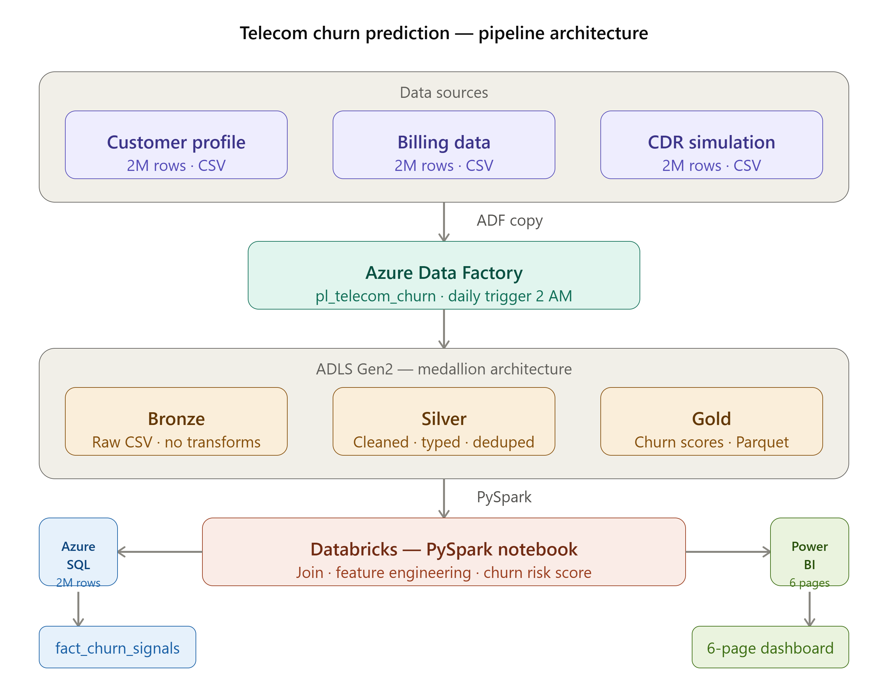
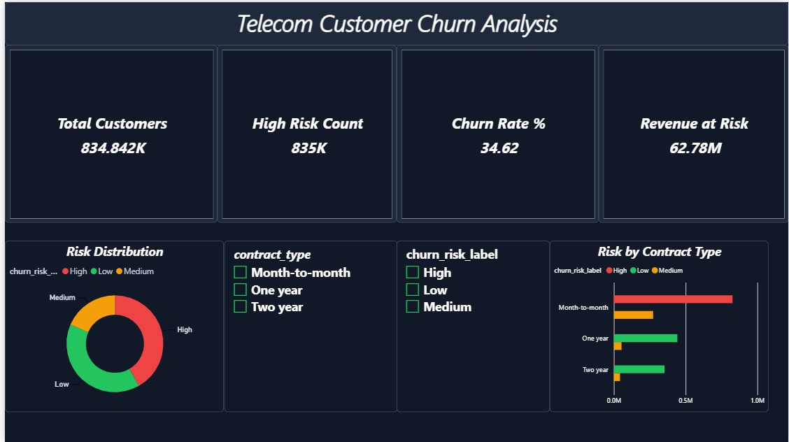
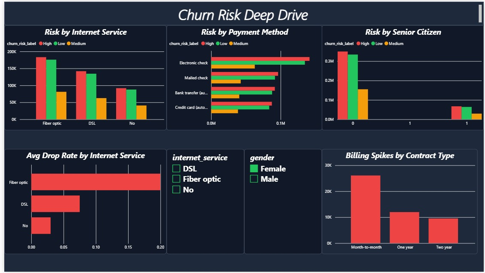
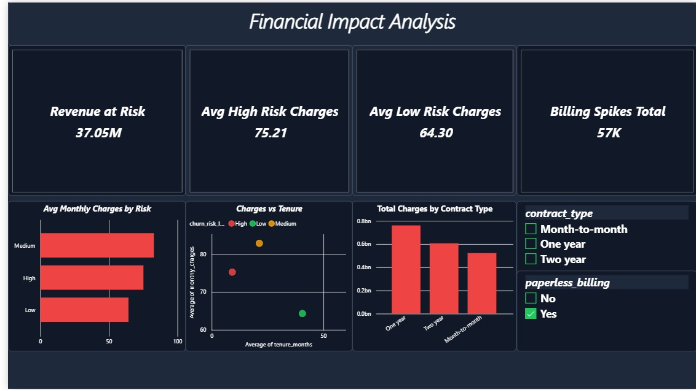
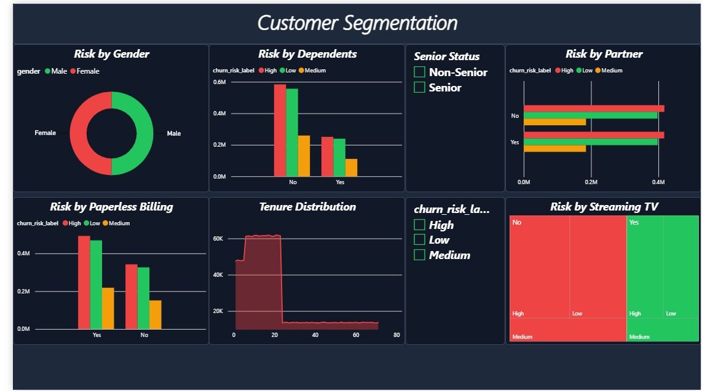
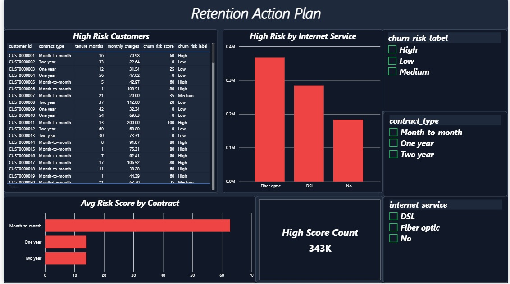
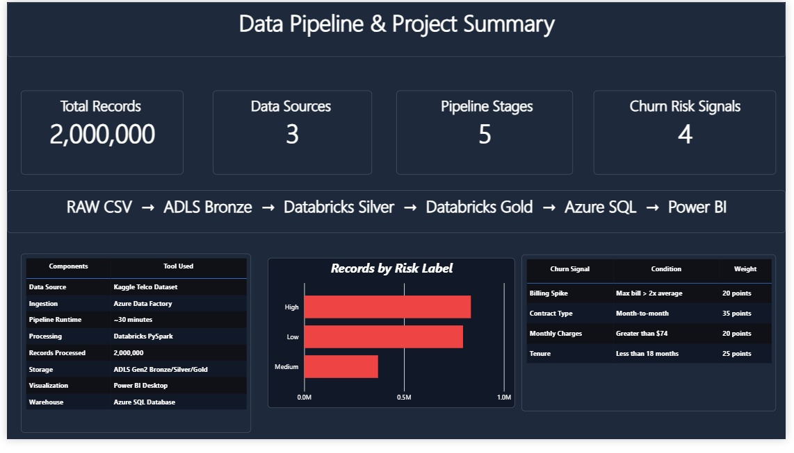

# 📡 Telecom Customer Churn Prediction Pipeline

An end-to-end Azure Data Engineering project that processes **2 million telecom customer records** using the **Azure Medallion Architecture (Bronze → Silver → Gold)** to identify churn risk signals and generate actionable business insights using **PySpark, Databricks, Azure SQL, and Power BI**.

---

# 🏗️ Solution Architecture



---

# 🛠️ Technology Stack

| Layer | Technology |
|-------|------------|
| Data Source | Synthetic Telecom Dataset (2M Rows) |
| Ingestion | Azure Data Factory |
| Storage | Azure Data Lake Storage Gen2 |
| Processing | Azure Databricks (PySpark) |
| Data Model | Medallion Architecture |
| Query Engine | Databricks SQL Warehouse |
| Visualization | Power BI Desktop |
| Orchestration | Azure Data Factory Pipeline |
| Language | Python, PySpark, SQL, DAX |

---

# 🏅 Medallion Architecture

## 🥉 Bronze Layer
Raw source data stored exactly as received.

Datasets:
- customer_profile.csv
- billing_data.csv
- cdr_simulation.csv

Purpose:
- Preserve raw data
- Enable replay and reprocessing
- Maintain auditability

---

## 🥈 Silver Layer
Cleaned and standardized datasets.

Transformations:
- Null handling
- Duplicate removal
- Type casting
- Standardized categorical values
- Data quality validation

---

## 🥇 Gold Layer
Business-ready analytical tables optimized for reporting.

Gold Tables:

| Table | Purpose |
|-------|---------|
| fact_churn_dashboard | Customer 360 view with churn risk |
| fact_customer_segments | Customer segmentation analysis |
| fact_revenue_summary | Revenue aggregation and KPIs |
| fact_contract_analysis | Contract type analysis |
| fact_service_usage | Service usage insights |
| dim_date | Time intelligence |

---

# 📊 Dashboard Screenshots

## Page 1 — Executive Overview


## Page 2 — Churn Risk Deep Dive


## Page 3 — Financial Impact Analysis


## Page 4 — Customer Segmentation


## Page 5 — Retention Action Plan


## Page 6 — Data Pipeline Summary


---

# 📈 Business KPIs

| Metric | Value |
|--------|-------|
| Total Customers Processed | 2,000,000 |
| High Risk Customers | 834,842 |
| High Risk Percentage | 41.74% |
| Overall Churn Rate | 34.62% |
| Revenue at Risk | $62.78M |
| Critical Risk Customers (Score ≥ 80) | 343,000 |

---

# 🔍 Churn Risk Signals

| Signal | Business Rule | Weight |
|--------|--------------|--------|
| Contract Type | Month-to-month contract | 35 Points |
| Tenure | Less than 18 months | 25 Points |
| Monthly Charges | Greater than $74 | 20 Points |
| Billing Spike | Bill exceeds 2x average | 20 Points |

Maximum Risk Score = **100 Points**

Risk Categories:

| Score Range | Risk Label |
|------------|-----------|
| 80 - 100 | High |
| 50 - 79 | Medium |
| 0 - 49 | Low |

---

# 📂 Project Structure

```text
telecom-churn-project/
│
├── Screenshots/
│   ├── telecom_churn_architecture.png
│   ├── page1_overview.png
│   ├── page2_churn_deepdive.png
│   ├── page3_financial_impact.png
│   ├── page4_customer_segments.png
│   ├── page5_retention_plan.png
│   └── page6_pipeline_summary.png
│
├── PowerBI Dashboard/
│   └── telecom_churn_dashboard.pbix
│
├── notebooks/
│   ├── 01_bronze_ingestion.ipynb
│   ├── 02_silver_transformation.ipynb
│   ├── 03_gold_business_logic.ipynb
│   ├── 04_register_sql_tables.ipynb
│   ├── 05_databricks_sql_warehouse.ipynb
│   └── 06_pipeline_validation.ipynb
│
├── scripts/
│   ├── generate_data.py
│   ├── split_data.py
│   └── risk_scoring.py
│
├── config/
│   └── config_sample.py
│
├── requirements.txt
│
├── README.md
│
└── .gitignore
```

---

# 🚀 End-to-End Pipeline Flow

```text
Synthetic Data
      ↓
Azure Data Factory
      ↓
ADLS Bronze Layer
      ↓
Databricks Silver Layer
      ↓
Databricks Gold Layer
      ↓
Databricks SQL Warehouse
      ↓
Power BI Dashboard
```

---

# ⚙️ Pipeline Execution Steps

## Step 1 — Data Generation

```python
N = 2_000_000

python scripts/generate_data.py
```

Generated datasets:

- customer_profile.csv
- billing_data.csv
- cdr_simulation.csv

---

## Step 2 — Bronze Layer

Raw datasets uploaded into:

```text
abfss://bronze@sttelcomchurn.dfs.core.windows.net/
```

No transformations performed.

---

## Step 3 — Silver Layer

Operations:

- Data cleansing
- Null handling
- Deduplication
- Type casting
- Data standardization

---

## Step 4 — Gold Layer

Operations:

- Join customer, billing and CDR datasets
- Feature engineering
- Risk score generation
- Churn segmentation
- Aggregation table creation

---

## Step 5 — Databricks SQL Warehouse

Published Gold tables:

- fact_churn_dashboard
- fact_customer_segments
- fact_revenue_summary
- fact_contract_analysis
- fact_service_usage
- dim_date

---

## Step 6 — Power BI

Features:

- 6 Interactive dashboard pages
- Dynamic DAX measures
- Slicers and filters
- Drill-down analysis

---

# 🔄 Azure Data Factory Pipeline

Pipeline Name:

```text
pl_telecom_churn_v2
```

Activities:

1. Bronze Load Notebook
2. Silver Load Notebook
3. Gold Load Notebook

Trigger:

```text
Daily at 02:00 AM
```

Connected Services:

- Azure Data Lake Storage Gen2
- Azure Databricks
- Databricks SQL Warehouse

---

# 📚 Key Learnings

- Azure Medallion Architecture
- Data Lake Design Patterns
- PySpark Distributed Processing
- Delta Lake Storage
- Databricks SQL Warehouse
- Azure Data Factory Orchestration
- Power BI Dashboard Development
- DAX Measure Development
- Cloud Resource Optimization

---

# 🎯 Interview Questions

## Why Medallion Architecture?

Bronze preserves raw immutable data, Silver provides clean and validated datasets, and Gold delivers business-ready analytics optimized for reporting and dashboards.

---

## Why PySpark instead of Pandas?

Although 2 million rows can be processed in pandas, PySpark provides distributed execution and scalability suitable for enterprise workloads containing billions of records.

---

## Why Databricks SQL Warehouse?

Databricks SQL Warehouse provides a high-performance analytical query engine optimized for BI workloads and seamless integration with Power BI.

---

## Why these churn signals?

The signals were identified through exploratory analysis and business understanding:

- Month-to-month customers have low switching costs.
- New customers have lower loyalty.
- High monthly charges create dissatisfaction.
- Billing spikes frequently lead to churn events.

---

## How does ADF orchestrate the pipeline?

ADF triggers Databricks notebooks in sequence:

```text
Bronze → Silver → Gold
```

The entire pipeline runs automatically every day at **2 AM**.

---

# 📏 Project Scale

- 2 Million Records
- 6 Gold Tables
- 6 Dashboard Pages
- 3 Data Sources
- 5 Azure Services
- Daily Automated Pipeline

---

# 👨‍💻 Author

## Vikas Mehta

Azure Data Engineering | Databricks | PySpark | Power BI | Azure Data Factory

[](https://github.com/vikasmehta1921)

[](https://www.linkedin.com/in/vikas-mehta-51173737b)

## ⭐ If you found this project useful, consider giving it a star on GitHub.
